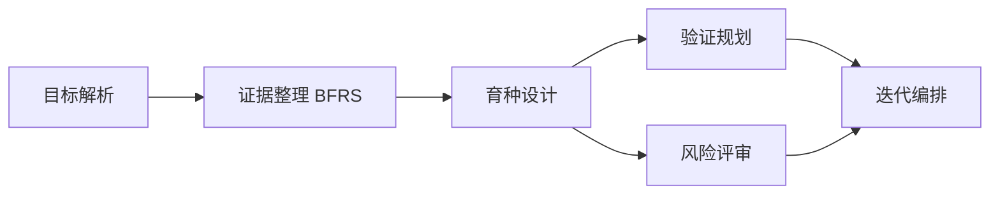
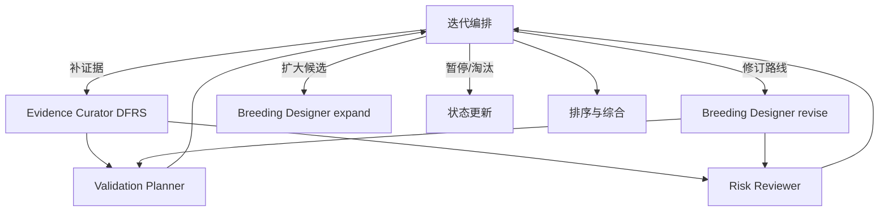

# 面向杂粮育种的证据驱动型多智能体科学家：系统方法论

> 本文档用于论文方法部分、系统设计部分和后续实验方案的统一依据。文档描述系统的科学问题、数据模型、六智能体闭环、证据图谱、候选路线排序、终止机制和可复现实验方法。

## 1. 研究定位

本系统不是面向通用问答的聊天机器人，也不是只负责生成文献摘要的检索系统，而是一个面向杂粮育种决策的 **Evidence-Grounded Iterative Breeding Scientist**。

系统接收育种者的自然语言目标，将其转化为结构化育种任务；随后联合本地种质资源、育种知识图谱、RAG 证据、标记/QTL 资料、表型协议、田间试验记录和外部科学资料，生成多个可验证的育种假设，并通过验证规划、风险审查、证据补充和迭代排序，形成可追溯的候选育种路线。

系统的输出不是“一个看起来合理的答案”，而是：

1. 具有明确作物、性状、环境和材料边界的育种假设；
2. 与假设对应的证据包和 Breeding Evidence Graph；
3. 可执行的材料选择、杂交、标记检测、表型鉴定和田间试验方案；
4. 对证据缺口、矛盾证据和部署风险的明确说明；
5. 经过闭环迭代和排序后形成的候选育种路线集合。

系统的定位应表述为 **育种科学决策支持系统**，而不是自动替代育种专家。最终的科学判断、材料使用和田间实施仍需经过专家审核与实验验证。

## 2. 研究问题

传统的大模型科研辅助流程通常存在四类问题：

- **目标不完整**：自然语言目标没有明确作物、环境、材料限制、成功标准和假设数量；
- **证据不成链**：文献、知识图谱、种质数据和实验记录以孤立文本存在，难以追溯材料、性状、基因/QTL、标记和验证方案之间的关系；
- **假设只生成不进化**：系统可以提出假设，却不能根据证据缺口、风险和专家意见决定保留、修改、扩展或淘汰；
- **排序缺少育种语义**：单一的语言模型偏好或简单 Elo 分数不能充分反映证据强度、选择可操作性、田间可行性、G×E 风险和验证成本。

因此，本系统围绕以下研究问题设计：

1. 如何把杂粮育种目标转换为可计算、可审查的育种问题边界？
2. 如何把异构本地知识和外部科学资料组织成可追溯的证据网络？
3. 如何让多个育种假设通过证据补充和风险反馈持续迭代，而不是一次性生成？
4. 如何在硬性科学门槛和多维育种价值之间进行可解释排序？
5. 如何保证每一次会话使用的知识边界、任务过程和最终结论可复现？

## 3. 核心设计原则

### 3.1 目标先于生成

系统首先解析目标，不允许在作物、目标性状、目标环境和成功标准尚未明确时直接生成育种假设。

### 3.2 证据先于结论

任何重要的育种主张都应绑定证据来源、来源类型、证据等级、适用遗传背景和待验证事项。模型推断不能被伪装成本地实验事实或已验证因果关系。

### 3.3 本地资源优先，外部资料补充

杂粮育种的关键约束往往来自本地种质、当地环境和本地表型协议。系统优先使用本地知识库，再用公开文献和工具检索补充外部证据。

### 3.4 生成与审查分离

提出假设的智能体不负责单独决定假设是否可以推进。验证规划、风险评审和迭代编排分别承担不同的审查职责。

### 3.5 任务队列驱动，而非固定流水线

第一轮可以具有清晰的启动顺序，但整个系统不是固定的六步串行流程。后续任务由当前证据、风险、缺口和假设状态动态产生，并通过持久化任务队列调度。

### 3.6 用户界面与内部实现解耦

用户看到的是目标解析、证据摘要、育种路线、风险和验证计划；任务编号、文件路径、模型名称和内部路由属于系统审计信息，不应成为默认用户界面。

## 4. 系统形式化定义

设用户目标为 (g)，目标解析器将其转换为结构化研究计划：

\[
P = (C, T, E, M, N_0, N_{max}, S, B)
\]

其中：

- (C)：作物或作物类别；
- (T)：目标性状及其优先级；
- (E)：目标环境、胁迫条件和试验场景；
- (M)：材料、种质和亲本限制；
- (N_0)：初始假设数量；
- (N_{max})：允许的最大假设数量；
- (S)：成功标准和终止条件；
- (B)：预算、时间和资源约束。

在第 (t) 轮，系统知识状态表示为：

\[
K_t = (G_t, R_t, L_t, Q_t, F_t)
\]

其中：

- (G_t)：Breeding Evidence Graph；
- (R_t)：结构化 RAG 证据索引；
- (L_t)：种质、标记/QTL、表型协议和田间试验记录；
- (Q_t)：任务队列和任务状态；
- (F_t)：专家反馈、风险意见和迭代决策。

一个育种假设表示为：

\[
h = (id, statement, mechanism, entities, design, validation, provenance)
\]

其中 `design` 是育种设计卡，至少应涉及材料、目标性状、候选机制、选择策略、杂交/回交路径、表型方案和预期结果；`provenance` 记录证据来源和父假设关系。

系统在每一轮根据当前状态产生动作：

\[
a_t \in \{keep, revise, expand, pause, reject\}
\]

动作不只是评分结果，而是闭环控制信号：

- `keep`：保留路线，进入排序或下一阶段验证；
- `revise`：围绕证据缺口或设计缺陷修订父路线；
- `expand`：扩大候选空间，寻找替代材料、机制或路线；
- `pause`：存在阻断性风险，等待专家或本地实验确认；
- `reject`：证据反驳或路线不可行，停止继续投入。

## 5. 六智能体架构

系统对外统一使用六个智能体身份。内部可以存在多个任务动作和执行阶段，但这些内部阶段必须映射回六个公共智能体。

| 顺序 | 智能体 | 方法职责 | 主要输入 | 主要输出 |
|---|---|---|---|---|
| 1 | Goal Interpreter（目标解析） | 将自然语言育种目标转为结构化研究计划 | 用户目标、偏好、限制 | 作物、性状、环境、材料约束、假设数量、成功标准 |
| 2 | Evidence Curator（证据整理） | 建立证据包和 Breeding Evidence Graph | 研究计划、知识快照、补证据请求 | 候选材料、基因/QTL、标记、证据链、缺口、图谱更新 |
| 3 | Breeding Designer（育种设计） | 生成或修订可操作的育种假设 | 研究计划、证据包、父路线、验证和风险上下文 | 结构化假设、育种设计卡、引用和预期育种收益 |
| 4 | Validation Planner（验证规划） | 把假设转化为可实施的验证路线 | 假设、材料、标记/QTL、表型协议、田间记录 | 分子验证、表型验证、杂交/回交方案、试验设计、推进阈值 |
| 5 | Risk Reviewer（风险评审） | 识别证据不确定性、矛盾和部署风险 | 假设、证据包、验证计划 | 风险清单、证据等级、矛盾、阻断条件、审查结论 |
| 6 | Iteration Orchestrator（迭代编排） | 根据审查结果决定下一轮动作和最终排序 | 假设、审查、风险、验证和排序记录 | 保留/修订/扩展/暂停/淘汰决策、补证据请求、最终综合 |

### 5.1 Goal Interpreter

目标解析是系统的边界定义层。它不能只提取几个关键词，而应把用户意图转换为可以约束后续检索和设计的研究计划。

最少需要明确：

- 作物或作物类别，例如谷子、水稻、荞麦、高粱、豆类或混合杂粮场景；
- 目标性状，例如抗旱、耐盐、抗倒伏、产量稳定性、籽粒品质；
- 目标环境，例如旱地、盐碱地、高温区或多地点环境；
- 目标性状之间的优先级和不可接受的代价；
- 可用种质、亲本、标记平台和田间资源；
- 初始假设数量和最大假设数量；
- 成功阈值、验证周期和停止条件。

该智能体的科学作用是防止检索漂移。例如，用户要求“耐盐且产量损失不超过 1%”，后续系统不能只因为检索到某个耐盐基因，就忽略产量约束。

### 5.2 Evidence Curator

Evidence Curator 不是简单的资料检索器，而是证据网络的构建者。它将以下信息统一转化为结构化证据包：

- 本地种质资源；
- 本地作物知识图谱；
- 本地 RAG 文档和证据卡；
- 标记/QTL 资料；
- 表型协议；
- 田间试验记录；
- 公开文献和外部检索结果；
- 本地实验记录和专家确认信息。

证据整理采用两种互补搜索模式：

**BFRS（Breadth-First Route Search）** 用于第一轮广度探索，围绕“目标性状—材料—基因/QTL—标记—环境—风险—文献”扩大候选空间；

**DFRS（Depth-First Route Search）** 用于对已有路线进行深度追踪，沿着“材料—性状—基因/QTL—标记—文献—本地记录—风险”的路径补齐证据链。

当前实现中的 Evidence Curator 以本地结构化知识为优先来源，并把外部文献作为下游工具调用和后续扩展入口。论文中应准确表述为“本地优先的证据整理与图谱构建模块”，不要把当前 V1 描述为已经完成所有外部数据库的自动统一接入。

### 5.3 Breeding Designer

Breeding Designer 输出的不是开放式观点，而是结构化育种设计卡。一个合格设计卡至少包括：

- 假设陈述；
- 目标性状及预期方向；
- 候选材料或亲本；
- 候选基因、QTL、标记或生理机制；
- 选择、杂交、回交或聚合策略；
- 表型和基因型验证方法；
- 目标环境和 G×E 考虑；
- 预期增益或可接受代价；
- 引用来源、证据等级和明确的不确定性。

生成时执行两级约束：

1. **硬边界约束**：不能超出 Goal Interpreter 定义的作物、环境和材料范围；
2. **重复控制**：对标题、陈述、机制和关键实体进行规范化，并结合已有假设和向量相似度进行去重；重复路线不再作为新的独立候选扩张。

修订时保留父假设 ID 和修订意图，使系统能够回答“新路线是从哪条路线演化而来、因为什么证据而改变”。

### 5.4 Validation Planner

Validation Planner 将“可能有效”转换为“如何验证”。它应优先使用本地已有的实验协议和田间记录，并明确：

- 需要确认的基因型或标记多态性；
- 需要测量的表型、时期、单位和重复；
- 对照、亲本和群体设计；
- 环境、地点和重复要求；
- 进入下一阶段的判定阈值；
- 何种结果会暂停或否定路线。

其输出不是对假设的再次润色，而是路线的实验可执行性约束。

### 5.5 Risk Reviewer

Risk Reviewer 负责识别以下风险：

- 证据来源等级过低；
- 只有近缘作物证据，没有目标作物证据；
- QTL 或标记来自不同遗传背景；
- 标记公开存在但目标亲本尚未验证；
- 表型只在单一环境或单一时期观察；
- 目标性状与产量、品质或周期之间存在潜在权衡；
- 存在矛盾证据；
- 缺少本地种质、试验或表型资料；
- 路线在本地育种条件下不可实施。

风险评审不等同于简单否决。风险被分为可补证据、需要修订、阻断性风险和反驳性证据，并向 Iteration Orchestrator 传递下一步行动建议。

### 5.6 Iteration Orchestrator

Iteration Orchestrator 是闭环控制层，而不是单纯的“总结智能体”。它综合证据缺口、验证规划、风险结果、专家意见和候选排序，决定：

- 是否继续保留路线；
- 是否回到 Evidence Curator 进行 DFRS；
- 是否让 Breeding Designer 修订父路线；
- 是否扩大候选空间并产生新的假设；
- 是否暂停等待专家或实验数据；
- 是否淘汰路线；
- 是否进入最终综合和排序。

因此，假设数量不是固定不变的。用户可以输入初始数量 (N_0) 和最大数量 (N_{max})，在后续迭代中系统可以生成新假设，但不能无边界扩张。

## 6. 任务队列与闭环执行

### 6.1 第一轮启动

第一轮的依赖关系可以概括为：

这里的“顺序”是数据依赖关系，不代表所有任务必须由同一个线程逐个等待。可独立执行的验证规划和风险评审可以并行。

### 6.2 后续迭代

任务由持久化 SQLite 队列驱动，具备：

- pending、leased/in-progress、done、failed、cancelled 等状态；
- 任务租约和失败恢复；
- 幂等键，避免重复生成或重复校准；
- 有界并发；
- 事件记录和实时页面更新；
- 按会话保存任务、产物和审查记录。

这种设计使系统可以从中断处恢复，也使论文能够报告每个会话实际执行了哪些任务。

## 7. Breeding Evidence Graph

### 7.1 图谱对象

图谱节点包括：

- 种质材料和亲本；
- 目标性状；
- 基因、QTL 和标记；
- 环境与胁迫；
- 表型协议；
- 田间试验；
- RAG 证据卡和文献；
- 育种假设；
- 风险和证据缺口。

图谱关系包括：

- `has_trait`：材料或假设涉及某性状；
- `carries_gene_or_qtl`：材料与基因/QTL 的关联；
- `has_marker`：标记关联；
- `adapted_to`：材料与环境适应性；
- `supported_by`：证据支持主张；
- `contradicted_by`：证据反驳主张；
- `requires_validation`：需要验证；
- `has_risk`：关联风险；
- `alternative_to`：替代路线；
- `used_in_scheme`：用于育种方案。

### 7.2 证据属性

每条证据应至少保存：

- 来源类型；
- 来源 ID 或 URL；
- 文本片段或结构化记录；
- 适用作物和遗传背景；
- 环境和表型条件；
- 证据等级；
- 支持、反驳或待验证关系；
- 采集时间和知识批次；
- 与会话和假设的关联。

推荐证据等级从强到弱为：

1. 本地实验记录；
2. 本地专家确认资料和 RAG 证据卡；
3. 本地高置信知识图谱关系；
4. 目标作物公开文献；
5. 近缘作物文献；
6. 模型推断或类比。

证据等级不能直接等同于假设总分。它主要用于确定可信边界、识别风险和设置推进门槛。

## 8. 知识库接入与可复现性

系统知识库由三类核心数据构成：

1. **结构化育种数据**：种质资源、标记/QTL、表型协议、田间试验；
2. **知识图谱**：节点、关系、作物包和证据路径；
3. **本地 RAG**：文献、实验记录、导师/专家资料和证据卡。

用户上传 ZIP 后，知识接入流程为：

预检包括：

- 文件类型和目录安全检查；
- CSV 字段和数据类型校验；
- KG 节点/边结构校验；
- RAG 文档切分和索引检查；
- ID、URL 和文件哈希去重；
- 相对上一批次的新增、替换、删除和未变化统计。

知识批次在专家审核前不改变当前运行知识库。审核通过后生成不可变知识快照。新会话绑定最新快照，同时保留旧知识的历史记录；已有会话继续使用创建时绑定的快照，从而避免运行中知识漂移。

该机制使同一研究目标可以被复现：只要保存会话配置、知识快照 ID、任务记录、模型配置和产物哈希，就可以还原该会话使用的知识边界。

## 9. 假设去重与假设演化

假设去重不能只比较标题字符串。建议采用以下规范化键：

\[
key(h) = normalize(crop, trait, mechanism, material, environment, strategy)
\]

实际判定可分三层：

1. **精确重复**：规范化后的陈述或实体组合完全相同；
2. **近重复**：标题、陈述和关键实体向量相似度超过阈值；
3. **语义不同但共享机制**：保留为独立路线，但记录共享机制和替代关系。

修订后的路线不应被当作全新孤立假设。它应保存：

- `parent_hypothesis_id`；
- 修订原因；
- 解决的证据缺口；
- 不再重复的错误路径；
- 新增或删除的材料、标记和验证步骤。

这样可以区分“重复生成”和“有证据依据的科学演化”。

## 10. 假设排序机制

排序采用“硬门槛 + 多维评分 + 成对校准”的组合机制，而不是单独依赖 Elo。

### 10.1 硬门槛

出现以下情况时，路线不能直接被列为可推进路线：

- 有明确反驳或 `disproved` 结论；
- 存在阻断性证据缺口或风险；
- 目标材料、标记或遗传背景完全无法确认；
- 验证方案缺少关键步骤；
- 违反用户设定的作物、环境、材料或成本边界。

硬门槛结果用于区分“可推进、待补证据、需修订、暂停和淘汰”，避免高分候选掩盖致命问题。

### 10.2 育种多维评分

对通过基本边界检查的候选路线，系统综合以下维度：

| 维度 | 解释 |
|---|---|
| 证据支持度 | 证据数量、来源质量、目标作物相关性和本地支持度 |
| 机制合理性 | 性状—机制—基因/QTL/标记之间的连贯性 |
| 遗传增益潜力 | 对目标性状产生遗传改良的潜力 |
| 选择可操作性 | 能否通过标记、表型或组合选择实施 |
| 田间试验可行性 | 是否有可执行的地点、协议、重复和对照 |
| G×E 风险 | 跨环境稳定性及环境依赖风险 |
| 表型成本 | 表型测定难度、设备和人力成本 |
| 育种周期 | 从亲本组合到可用材料所需时间 |
| 部署风险 | 亲本、标记、协议和本地适应性的不确定性 |

一个候选路线的综合分可以抽象表示为：

\[
S(h) = \sum_i w_i q_i(h) - \sum_j \lambda_j r_j(h)
\]

其中 (q_i) 是育种价值维度，(r_j) 是风险和缺口，权重 (w_i) 与用户目标和系统配置有关。论文中应报告权重、阈值和敏感性分析，不应只报告一个不可解释的最终数字。

### 10.3 成对校准

当多个路线难以直接比较时，Iteration Orchestrator 组织成对判断。对路线 (a,b)，先计算：

\[
E_a = \frac{1}{1+10^{(R_b-R_a)/400}}
\]

若 (a) 获胜，则：

\[
R_a' = R_a + K(1-E_a), \quad R_b' = R_b - K(1-E_a)
\]

若 (b) 获胜，则反向更新。新路线使用较大的 (K) 以快速校准，经过若干次比较后使用较小的 (K) 以降低波动。当前实现中使用的是 32/16 的新路线与稳定路线因子。

成对校准的作用是提高候选排序的一致性，不代表模型判断是真实育种效果，更不能替代田间试验。它应作为多维评分的辅助排序信号，并受到硬门槛和证据等级约束。

## 11. 终止条件

系统终止不是“模型没有话可说了”，而是满足明确的运行和科学条件。主要条件包括：

- 达到预算上限；
- 达到最大运行时间；
- 任务队列空闲且没有可产生的后续任务；
- 候选路线数量和成对校准数量达到要求；
- 主要候选路线的排序在连续校准中趋于稳定；
- 达到最大假设数量；
- 专家或外部事件要求暂停或终止。

终止时系统应写入终止原因、已生成假设数量、可推进路线数量、待补证据数量、风险数量、校准次数和最后知识快照 ID。

一个会话“完成”不等于所有路线都已被证明有效。更准确的状态应区分：

- 已形成可推进路线；
- 已形成候选路线但仍需补证据；
- 当前没有满足推进门槛的路线；
- 因阻断性风险暂停；
- 因预算或时间限制结束。

## 12. 人机协同与专家审核

专家审核是两个层面的控制点：

### 12.1 知识批次审核

审核新上传的数据是否可以进入知识库，包括格式、来源、字段、重复和科学可信度。未通过审核的数据只能停留在待审核批次，不参与新的育种会话。

### 12.2 智能体成果审核

专家可以针对六个智能体形成的成果记录“通过、需修改或不通过”，并填写依据、修改要求或补充验证要求。审核意见应转化为后续任务，而不是只作为页面备注。

这种机制形成“机器提出—证据审查—专家确认—机器迭代—实验验证”的闭环。

## 13. 可复现实验设计

论文不能只展示一个成功案例，应至少从以下层面评价系统。

### 13.1 数据集

建议覆盖多类杂粮及代表性育种目标：

- 谷子：抗旱、抗倒伏、成熟期和籽粒品质；
- 高粱：耐旱、耐盐和产量稳定性；
- 荞麦：倒伏、低温和品质；
- 水稻或玉米：作为外部对照作物，检验跨作物知识迁移的风险；
- 本地种质和实验记录：检验系统是否真正利用本地资源。

每个任务应固定：目标、允许材料、目标环境、成功标准、初始假设数、最大假设数、预算、知识快照和专家参考答案。

### 13.2 评价指标

**目标解析层**：作物、性状、环境、材料约束和成功标准抽取准确率。

**证据层**：

- 证据召回率和精确率；
- 来源可追溯率；
- 目标作物相关证据比例；
- 本地知识命中率；
- 证据缺口识别准确率；
- 矛盾证据发现率。

**假设层**：

- 专家可接受率；
- 重复率和新颖性；
- 关键育种实体覆盖率；
- 引用有效率；
- 育种设计卡完整度。

**路线层**：

- 路线排序与专家排序的 Spearman/Kendall 相关；
- 可推进路线精确率；
- 阻断风险漏检率；
- 验证方案可执行率；
- 迭代后专家接受率提升。

**系统层**：

- 会话完成率；
- 预算使用率；
- 平均延迟；
- 任务失败恢复率；
- 知识快照复现一致性；
- 人工审核耗时。

### 13.3 消融实验

建议至少设置以下对照：

1. 去掉 Evidence Graph，仅使用文本 RAG；
2. 去掉本地种质资源；
3. 去掉知识快照，使用动态知识库；
4. 去掉 DFRS 闭环，只运行一次 BFRS；
5. 去掉 Risk Reviewer；
6. 去掉 Validation Planner；
7. 去掉成对校准，只用静态综合分；
8. 去掉专家反馈；
9. 单智能体基线或传统 RAG 基线；
10. 完整六智能体系统。

消融实验的核心不是证明“智能体越多越好”，而是回答每一个模块是否减少了特定错误：证据缺失、路线重复、风险漏检、验证不可执行或排序不稳定。

## 14. 论文中的主要贡献表述

在完成实验验证后，论文可以围绕以下贡献组织：

1. 提出一种面向杂粮育种的证据驱动型多智能体闭环框架；
2. 提出将种质资源、知识图谱、RAG 和育种试验记录统一为 Breeding Evidence Graph 的方法；
3. 提出 BFRS/DFRS 结合的广度探索与路线深挖机制；
4. 提出将证据缺口、风险和验证规划转化为假设演化动作的方法；
5. 提出硬门槛、多维育种评分和成对校准相结合的路线排序方法；
6. 提出带知识快照、任务审计和专家审核的可复现育种会话机制。

贡献表述必须以实验证据为前提。如果尚未完成跨作物验证、外部文献全量接入或真实田间结果验证，应写成“系统设计”或“候选路线生成能力”，不能写成“证明了育种效果”。

## 15. 方法边界与后续工作

当前版本仍有以下边界：

- Evidence Curator 的外部文献整合能力仍需进一步统一；
- 模型生成的机制关系不能替代遗传验证；
- 成对校准反映相对优先级，不等于真实遗传增益；
- 知识图谱的完整性取决于输入数据质量和实体标准化；
- 田间 G×E 结论需要多环境、多年份数据支持；
- 专家审核标签仍需要形成稳定的标注规范和一致性评估。

后续工作可以包括：

1. 引入标准化作物本体、基因和标记命名体系；
2. 建立跨批次实体对齐和来源冲突管理；
3. 接入结构化文献数据库并保留全文证据片段；
4. 使用专家双人或多人标注评估路线排序一致性；
5. 用真实育种试验结果回填验证节点；
6. 建立从“证据强度”到“实际育种收益”的纵向追踪。

## 16. 推荐论文结构

1. **Introduction**：杂粮育种决策的复杂性、知识异构性和证据缺口；
2. **Related Work**：农业知识图谱、RAG、科学智能体、自动假设生成和育种决策支持；
3. **Problem Formulation**：育种目标、证据状态、假设和闭环动作的形式化定义；
4. **Method**：六智能体架构、Breeding Evidence Graph、BFRS/DFRS、验证规划、风险评审和排序机制；
5. **System Implementation**：知识批次、快照、任务队列、产物审计、专家审核和 Web 展示；
6. **Experiments**：数据集、基线、指标、消融和专家评估；
7. **Case Study**：以谷子或其他杂粮为例展示一条路线从生成到修订的全过程；
8. **Limitations and Ethics**：模型不确定性、数据偏差、专家责任和实验安全边界；
9. **Conclusion**：证据驱动、可迭代、可审计的杂粮育种科学家框架。

## 17. 实现对应关系

论文撰写时可用以下代码模块作为实现证据：

| 方法部分 | 主要实现位置 |
|---|---|
| 六智能体公共身份 | `co_scientist/agents/display.py` |
| 任务调度与闭环 | `co_scientist/agents/supervisor.py` |
| 证据包与证据图 | `co_scientist/agents/evidence_curator.py` |
| 育种假设生成与去重 | `co_scientist/agents/breeding_designer.py` |
| 验证规划 | `co_scientist/agents/validation_planner.py` |
| 风险和证据评审 | `co_scientist/agents/evidence_review.py`、`risk_reviewer.py` |
| 迭代决策 | `co_scientist/agents/iteration_orchestrator.py` |
| 成对校准 | `co_scientist/orchestrator/pairwise_calibration.py` |
| 终止机制 | `co_scientist/orchestrator/termination.py`、`breeding_termination.py` |
| 知识快照 | `co_scientist/knowledge/snapshot.py` |
| 知识批次接入 | `co_scientist/knowledge/intake.py` |
| 产物与审查记录 | `co_scientist/storage/artifacts.py`、`storage/repos/agent_output_reviews.py` |

这份方法论的核心判断是：系统的创新点不在于“使用了六个模型调用”，而在于把育种目标、证据图谱、假设设计、验证方案、风险控制和迭代排序组织成了一个可追溯的科学决策闭环。
